# Análisis Cuantitativo Artículos Nueva Constitución
Para el analisis del texto se realiza un tratamiento previo de las palabras de tal forma faciliar la interpretación y normalizar/igualar palabras que permitan que la agregación sea más representativa y muestre de mejor manera el uso de palabras. 

Para ello es que utilizamos herramientas de expresión regular y funciones de procesamiento de lenguaje natural (librería NLTK): 
- transformación letras a minúsculas
- eliminación de tildes
- eliminación de caracteres especiales
- eliminación de stopwords o palabras funcionales que no son relevantes (ej. artículos)
- transformación de palabras a su raiz (stemming), de esta forma palabras que tienen el mismo significado pero que estén en distinto tiempo verbal o similar, se pueden agrupar    

## Texto Completo
---
Antes de realizar el tratamiento de lenguaje natural sobre el texto, se realiza un análisis del total de palabras y riqueza léxica. 

**palabras totales** = 5.1106 

**palabras únicas** = 4.995 

**riqueza léxica** = 0.098

Además podemos determinar cuales son las palabras que aparecen solo 1 vez en el texto: 

tamaños lista hapaxes=2.042

Algunos ejemplos: 
regresivo
disminuya
menoscabe
injustificadamente
arbitrariamente
restringida
sorprendida
deudas
remediacion
cuerpo
placer
anticoncepcion
gestar
interrupcion
voluntarios
violencias
interferencias
individuos
beneficiarse
cientifico
discriminatoria ... para listado completo referirse a archivo hapax.txt

Ahora procesamos las palabras del texto aplicando la herramientas de la libreria NLTK (salvo stemming) para representar la frecuencia de palabras del texto en distintas vistas. 

**Wordcloud Texto Completo** 

A partir de las palabras con mayor frecuencia se grafica la dispersión de frecuencia de palabras y su dispersión léxica dentro del texto. 

**Gráfico Dispersion frecuencia top10 palabras**

**Gráfico Dispersión Léxica**

Luego analizamos las palabras aplicando stemming

**Wordcloud Texto Completo con stemming** 

**Gráfico Dispersion frecuencia top10 palabras stemming**

**Gráfico Dispersión Léxica stemming**

## Comisiones
---
Se analiza de forma separada los artículos redactados por las distintas comisiones
- 1: ' Sistemas de Conocimientos, Culturas, Ciencia, Tecnología, Artes y Patrimonios'
- 2: ' Derechos de los Pueblos Indígenas y Plurinacional  '   
- 3: ' Sistema de Justicia, Órganos Autónomos de Control y Reforma Constitucional'
- 4: ' Derechos Fundamentales'
- 5: ' Sobre Principios Constitucionales, Democracia, Nacionalidad y Ciudadanía'
- 6: ' Forma de Estado, Ordenamiento, Autonomía, Descentralización, Equidad, Justicia Territorial, Gobiernos Locales y Organización Fiscal'
- 7: ' Medio Ambiente, Derechos de la Naturaleza, Bienes Naturales Comunes y Modelo Económico'
- 9: ' Sobre Sistema Político, Gobierno, Poder Legislativo y Sistema Electoral'

### Comision 1: Sistemas de Conocimientos, Culturas, Ciencia, Tecnología, Artes y Patrimonios
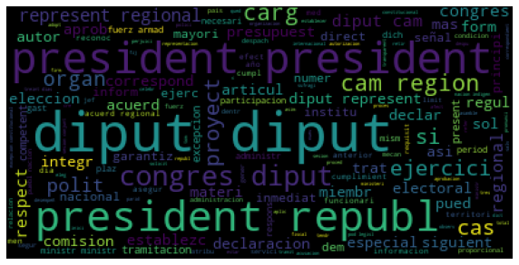
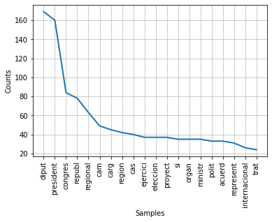

### Comision 2: Derechos de los Pueblos Indígenas y Plurinacional
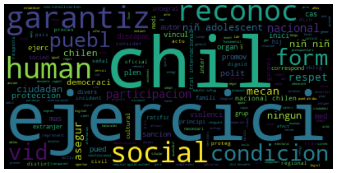
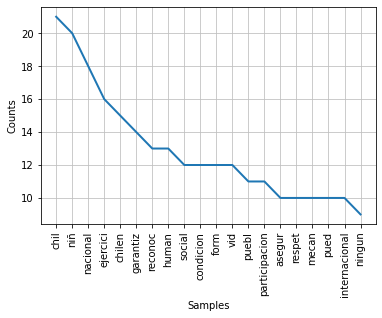

### Comision 3: Sistema de Justicia, Órganos Autónomos de Control y Reforma Constitucional
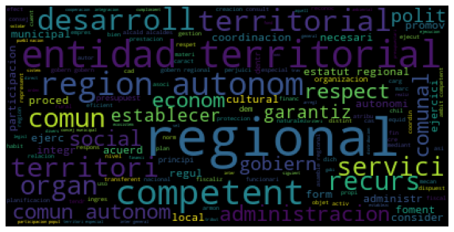
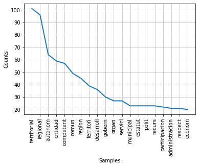
### Comision 4: Derechos Fundamentales
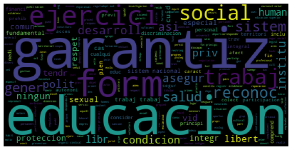

### Comision 5: Sobre Principios Constitucionales, Democracia, Nacionalidad y Ciudadanía
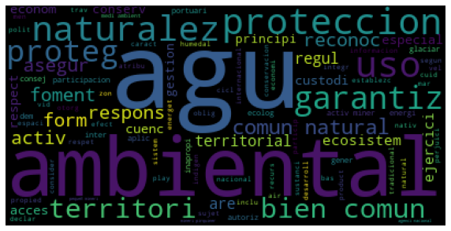
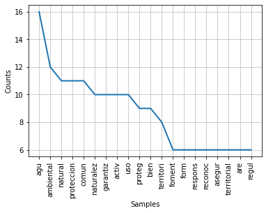
### Comision 6: Forma de Estado, Ordenamiento, Autonomía, Descentralización, Equidad, Justicia Territorial, Gobiernos Locales y Organización Fiscal
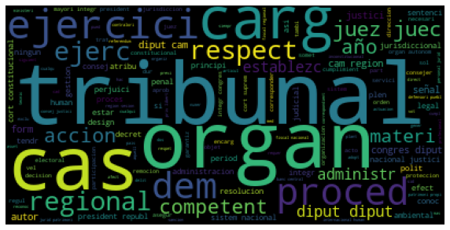
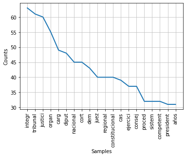
### Comision 7: Medio Ambiente, Derechos de la Naturaleza, Bienes Naturales Comunes y Modelo Económico
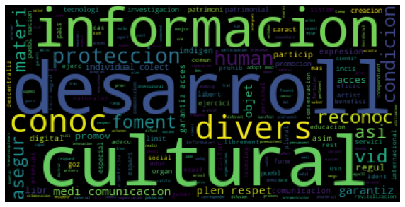
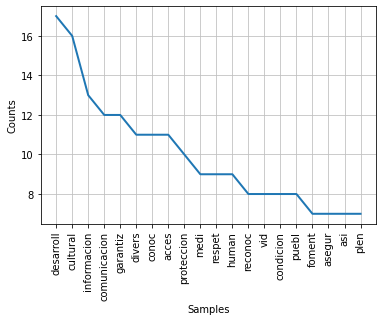
### Comision 9: Sobre Sistema Político, Gobierno, Poder Legislativo y Sistema Electoral
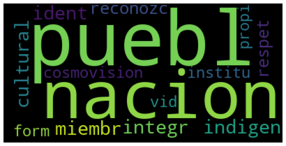
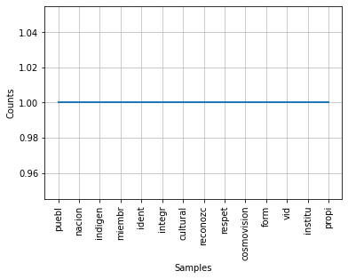

## Clusters de palabras
Análisis exploratorio utilizando distintas técnicas de clustering para determinar si existen patrones dentro del texto en base a las palabras utilizadas. 

### Clase 0
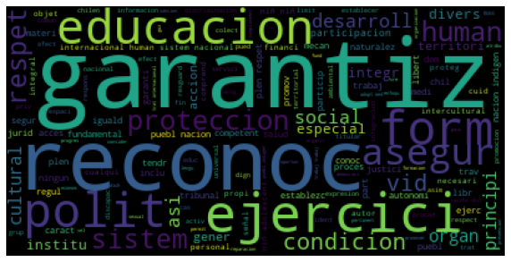
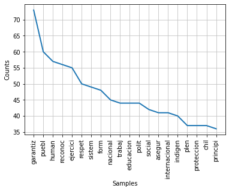
### Clase 1
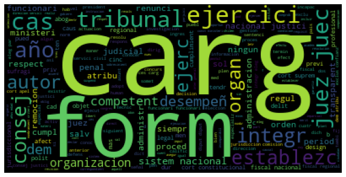
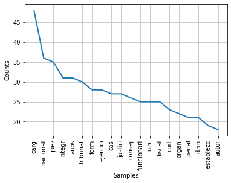
### Clase 2
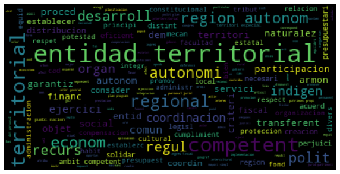
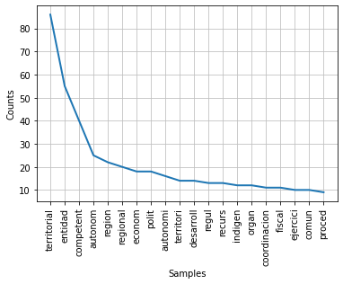
### Clase 3
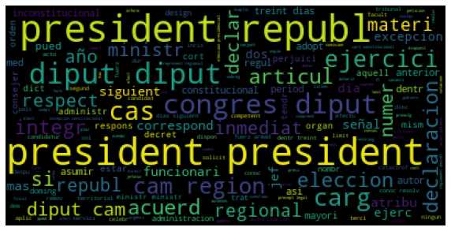
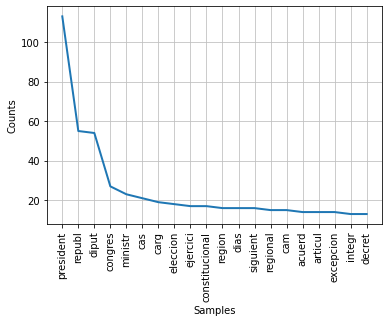
### Clase 4
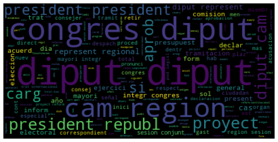
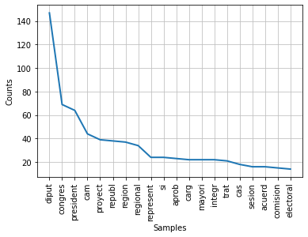
### Clase 5
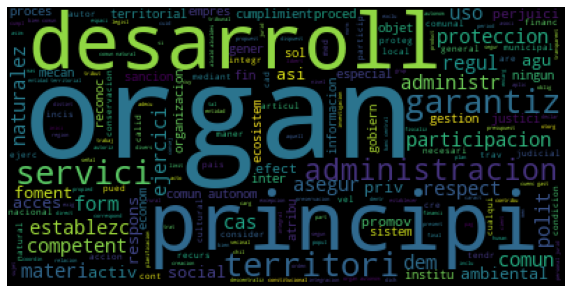
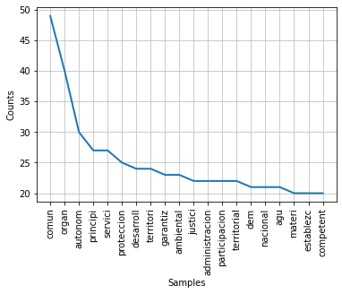
### Clase 6
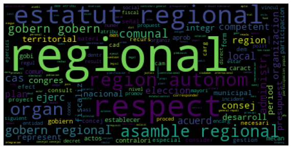
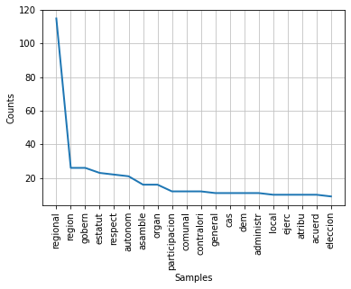